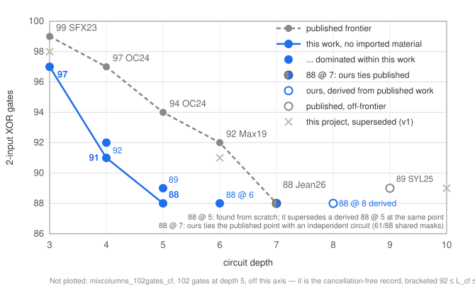

# Small XOR circuits for AES MixColumns

**This repository provides verified 2-input XOR circuits for AES MixColumns
that improve the entire published depth–count Pareto frontier: 97 gates at the
minimum possible depth 3, 92 gates at depth 4, and 89 gates at depth 5 — the
smallest count we are aware of at any depth, two below the smallest published
count (91).**

All circuits ship with self-contained verifiers. Every circuit is a static,
machine-checkable artifact, and nothing here depends on how the circuits were
found. A source-by-source audit of the comparison claims is in
[`PRIOR_ART.md`](PRIOR_ART.md).

**The search method that produced these circuits is public** — a value-set
shortest-linear-program local search with plateau and hub moves — in its own
repository, [`slp-plateau-search`](https://github.com/Joe-b-20/slp-plateau-search):
the method write-up, the search pipeline, the untouched archives of the runs
that produced each record, and a single-command pure-Python reproduction of
the from-scratch depth-3 record.

## The circuits

| File | Gates | Depth | Published best at that depth |
|---|---|---|---|
| `circuits/mixcolumns_97gates_depth3.json` | 97 | **3** | 99 (Shi, Feng, and Xu, ToSC 2023) — depth 3 is the known minimum depth (see below) |
| `circuits/mixcolumns_92gates_depth4.json` | 92 | **4** | 97 (Osvik and Canright, ePrint 2024/1076, App. G) |
| `circuits/mixcolumns_89gates_depth5.json` | **89** | **5** | 94 (Osvik and Canright, ePrint 2024/1076, App. F); smallest published count at *any* depth is 91 (Lin et al., CT-RSA 2021) |

Earlier circuits from this project, kept for the archival record (each is now
dominated by a circuit above):

| File | Gates | Depth | Superseded by |
|---|---|---|---|
| `circuits/mixcolumns_98gates_depth3.json` | 98 | 3 | 97 @ depth 3 |
| `circuits/mixcolumns_91gates_depth6.json` | 91 | 6 | 89 @ depth 5 |
| `circuits/mixcolumns_89gates_depth10.json` | 89 | 10 | 89 @ depth 5 |

The v1 circuits were found by earlier, more primitive versions of the same
search, whose exact code state was not preserved; what is and is not
reconstructable about their provenance is documented honestly in the method
repository
([METHODS.md, "Provenance of the earlier (v1) circuits"](https://github.com/Joe-b-20/slp-plateau-search/blob/main/METHODS.md)).
No current claim depends on them — they remain here as verified artifacts,
and correctness is machine-checkable regardless of provenance.

The published comparison points, source-checked (details and exact quotes in
`PRIOR_ART.md`): the published depth–count Pareto frontier for AES MixColumns
in comparable models is **99 @ depth 3** (Shi, Feng, and Xu, ToSC 2023),
**97 @ depth 4** and **94 @ depth 5** (Osvik and Canright, ePrint 2024/1076),
**92 @ depth 6** (Maximov, ePrint 2019/833; also Xiang et al., ToSC 2020,
s-XOR), and **91 @ depth 7** (Lin, Xiang, Zeng, and Zhang, CT-RSA 2021,
s-XOR). Because a `k`-instruction s-XOR program translates
instruction-for-gate into a `k`-gate 2-input XOR circuit, we treat s-XOR
counts as comparable. Yuan et al. (ToSC 2024) also report 91 XORs in an
`s-XOR` / quantum-depth framing. The circuits above improve the frontier at
every depth from 3 to 5 and dominate the deeper points. See **Claims and
scope** below for the careful wording.

Each circuit is also provided as a human-readable plain-text listing in
`listings/` (`s32 = s15 ^ s23`, one gate per line, generated from the JSON —
see `scripts/generate_listings.py`).

A depth note: the minimum depth of AES MixColumns in this model is 3, a known
fact stated e.g. by Shi, Feng, and Xu. It follows from the standard bound that
an output depending on `w` inputs needs depth at least `⌈log₂ w⌉`, and
MixColumns has outputs depending on 7 inputs. The 97-gate circuit attains
this known minimum; its contribution is the gate count at that depth, not the
depth itself.

## The exact model

- A circuit is a list of **2-input XOR gates over GF(2)**.
- **Signals** are indexed from 0. Signals 0..31 are the 32 input bits.
- Gate `k` produces signal `32 + k`, whose value is
  `signal[gates[k][0]] XOR signal[gates[k][1]]`. Both parent indices are
  strictly smaller than the produced signal index `32 + k`, so the circuit is
  a DAG in list order.
- **Depth** of a signal = longest path in gates from any input; inputs have
  depth 0. Circuit depth = maximum over all gates.
- **Outputs**: `outputSignals[j]` names the signal carrying MixColumns output
  bit `j`, for `j = 0..31`.

### Bit / byte convention (this is the whole convention)

The AES state is four bytes `s0,s1,s2,s3`. Bit index `i` in 0..31 means bit
`(i mod 8)` of byte `(i div 8)`, least-significant-bit-first within each byte.
MixColumns maps input column `(a0,a1,a2,a3)` to the output column with
`out[c] = 2·a[c] ⊕ 3·a[(c+1)%4] ⊕ 1·a[(c+2)%4] ⊕ 1·a[(c+3)%4]`, with
multiplication in GF(2⁸) modulo `x⁸+x⁴+x³+x+1` (`0x11b`). This is the
standard forward MixColumns map from NIST FIPS 197-upd1, Section 5.1.3, Eq. 5.6.

The verifier rebuilds this specification from scratch, so the convention is not
just described in prose; it is executable. If your convention differs, such as a
different bit order or a transposed matrix, regenerate the target masks under
that convention before comparing counts.

## Verify

Pure Python 3, no dependencies:

~~~text
python3 verify_all.py
~~~

This runs the shipped software verification paths:

- `verify.py`: the lightweight repository verifier.
- `audit/cleanroom_verify.py`: a separate clean-room verifier that rebuilds AES
  MixColumns from an independent byte-level reference, recomputes metrics, runs
  deterministic random tests, and exercises adversarial rejection cases.

For a faster single-path check, you can still run:

~~~text
python3 verify.py
~~~

If Icarus Verilog is installed, you can also run the shipped hardware path:

~~~text
python3 verify_verilog.py
python3 verify_all.py --with-verilog
~~~

### Hardware (Verilog)

`verilog/<circuit>.v` is the netlist and `verilog/<circuit>_tb.v` is a testbench
that drives all 32 basis inputs and compares against the AES column masks.
`verify_verilog.py` automates all three shipped testbenches. For a single manual
run with Icarus Verilog:

~~~
cd verilog
iverilog -o sim.vvp mixcolumns_89gates_depth5.v mixcolumns_89gates_depth5_tb.v && vvp sim.vvp
~~~

Expected output includes `PASS: all 32 basis vectors correct`. The testbench
drives each unit input `e_i` and compares the output word against column
`i` of the MixColumns matrix: output bit `j` is set iff input `i` feeds
output `j`. This is the column, not row `T[j]`, because the matrix is not
symmetric.

## bounds.json

Machine-readable summary: for each circuit, `inputCount`, `gateCount`, `depth`,
`outputCount`, the `outputConvention` string, the exact
`sha256_circuit_json`, the exact `sha256_canonical_gates`, and additional
archival metadata.
`sha256_canonical_gates` is SHA-256 over the UTF-8 bytes of the compact JSON
string `{"inputCount":32,"gates":[...]}` with keys in that order. The rule is
implemented in `scripts/reproduce_canonical_hashes.py`. Both `verify.py` and
`audit/cleanroom_verify.py` recheck the circuit-file hash, the canonical gate
hash, and the declared gate/depth metadata.

## Claims and scope (please read)

We state results conservatively.

1. **Fewest we are aware of, not optimal.** We do **not** prove these gate
   counts are minimal. Minimality of XOR-circuit size, the Shortest Linear
   Program problem, is NP-hard and unproven for this matrix at the sizes here.
2. **Source-checked baselines.** The published depth–count frontier we compare
   against: 99 @ depth 3 (Shi, Feng, and Xu, ToSC 2023); 97 @ depth 4 and 94 @
   depth 5 (Osvik and Canright, ePrint 2024/1076, Appendices G and F); 92 @
   depth 6 (Maximov, ePrint 2019/833); 91 @ depth 7 (Lin, Xiang, Zeng, and
   Zhang, CT-RSA 2021, stated in the `s-XOR` in-place model — every
   `k`-instruction s-XOR program yields a `k`-gate 2-input XOR circuit, so we
   treat it as comparable). Yuan et al. (ToSC 2024) likewise report 91 XORs in
   an `s-XOR` / quantum-depth framing. Results in other cost models
   (multi-input XOR gates, gate-equivalent area, quantum CNOT circuits) are
   not comparable and are not claimed against; see `PRIOR_ART.md`. Gate counts
   and depths are invariant under input/output bit relabeling, so these
   comparisons do not depend on convention choices.
3. **Convention.** All counts are for the exact 2-input-XOR model and the
   exact MixColumns convention defined above. A hidden convention mismatch is
   the most common way such a comparison goes wrong, which is why the
   from-scratch verifier is included.
4. **Circuits vs. search.** The circuits in this folder are fully verifiable:
   anyone can re-run `verify.py` and confirm them forever, and none of the
   claims here depend on how they were found. The search method is published
   separately in
   [`slp-plateau-search`](https://github.com/Joe-b-20/slp-plateau-search),
   with the run evidence and reproduction instructions for each record.

## Contents

~~~
circuits/    six circuit JSON files (the three current records + three superseded v1 circuits)
listings/    the same circuits as human-readable plain text (generated)
docs/        generated figures (the depth-count frontier chart)
PRIOR_ART.md source-by-source audit of every comparison claim
bounds.json  annotated summary + integrity metadata
verify.py    lightweight repository verifier
verify_all.py runs the repository verifier, clean-room verifier, and optional Verilog wrapper
verify_verilog.py compiles and runs all shipped Verilog testbenches when Icarus is available
scripts/     helper scripts for reproducing published metadata
audit/       clean-room verifier and its generated audit reports
verilog/     one netlist + one testbench per circuit
tests/       regression tests for shipped and malformed artifacts
PAPER.md     short write-up with conservative claims and caveats
paper/       LaTeX source of the ePrint note (appendices generated from circuits/)
~~~

## References

- National Institute of Standards and Technology, Advanced Encryption Standard
  (AES), NIST FIPS 197-upd1, May 9, 2023. DOI:
  <https://doi.org/10.6028/NIST.FIPS.197-upd1>
- Alexander Maximov, AES MixColumn with 92 XOR Gates, IACR ePrint 2019/833.
  <https://eprint.iacr.org/2019/833.pdf>
- Dag Arne Osvik and David Canright, A More Compact AES, and More, IACR
  ePrint 2024/1076. <https://eprint.iacr.org/2024/1076>
- Da Lin, Zejun Xiang, Xiangyong Zeng, and Shasha Zhang, A Framework to
  Optimize Implementations of Matrices, Topics in Cryptology – CT-RSA 2021,
  LNCS 12704, Springer, 2021. DOI:
  <https://doi.org/10.1007/978-3-030-75539-3_25>
- Zejun Xiang, Xiangyong Zeng, Da Lin, Zhenzhen Bao, and Shasha Zhang,
  Optimizing Implementations of Linear Layers, IACR Transactions on Symmetric
  Cryptology, 2020(2):120-145. DOI:
  <https://doi.org/10.13154/tosc.v2020.i2.120-145>
- Haotian Shi, Xiutao Feng, and Shengyuan Xu, A Framework with Improved
  Heuristics to Optimize Low-Latency Implementations of Linear Layers, IACR
  Transactions on Symmetric Cryptology, 2023(4):489-510. DOI:
  <https://doi.org/10.46586/tosc.v2023.i4.489-510>
- Yufei Yuan, Wenling Wu, Tairong Shi, Lei Zhang, and Yu Zhang, A Framework to
  Improve the Implementations of Linear Layers, IACR Transactions on
  Symmetric Cryptology, 2024(2):322-347. DOI:
  <https://doi.org/10.46586/tosc.v2024.i2.322-347>

## License / citation

Released under MIT for archival reuse. If you use a circuit, please cite the
accompanying note ([`paper/mixcolumns_note.pdf`](paper/mixcolumns_note.pdf);
`PAPER.md` is the short markdown version) and this repository via the
archived DOI: <https://doi.org/10.5281/zenodo.21299092> (see `CITATION.cff`).
